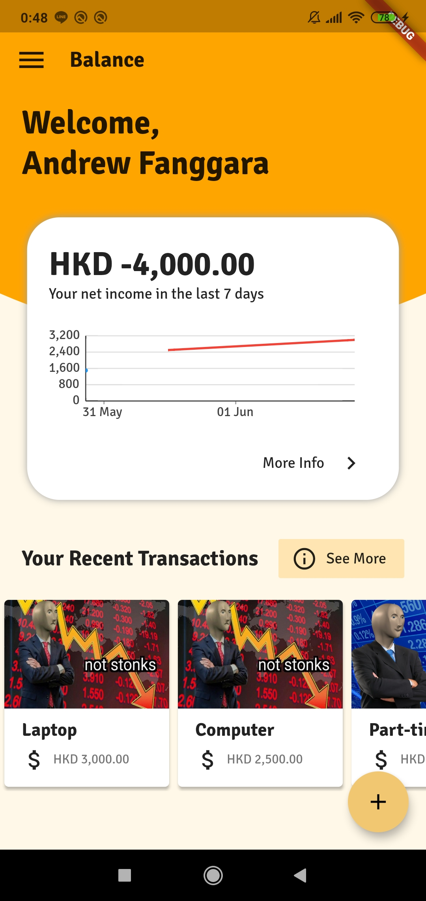
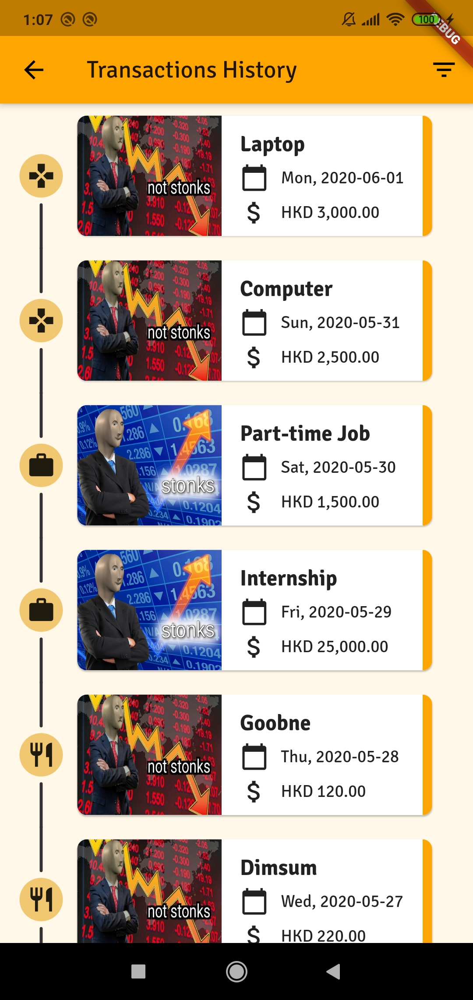

# StudentApp

An application for students to help them in managing their daily schedules and expenses.

## Screenshots

  
  
  
  

## Features (To Be Implemented):

- [x] Authentication using google sign in firebase
- [x] CRUD TODO List (TODO: Store them using Firestore, no Consumer<T> implemented yet in the schedule screens)
- [ ] Push Notifications to remind their upcoming tasks
- [x] Calendars
- [x] CRUD List of Expenses (TODO: Store them using Firestore)
- [x] Analytics and Charts Visualization of their expenses

## Tech Stacks

- Flutter
- Dart
- Firebase

## Installations

TODO:

## Demo Application (APK)

TODO:
